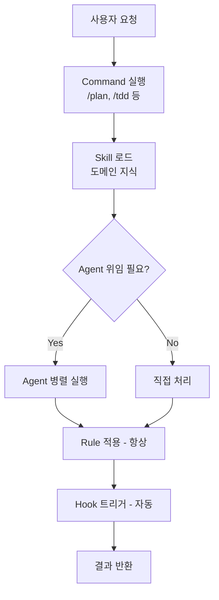
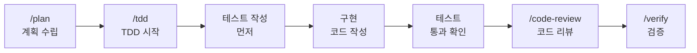
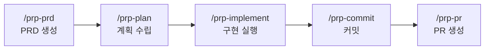
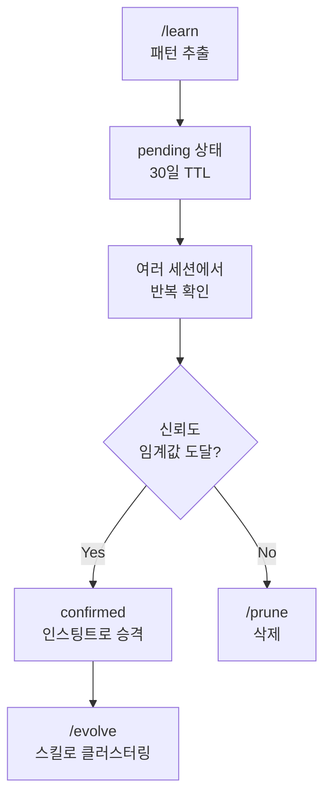

이 글은 **Everything Claude Code(ECC)가 무엇인지, 어떻게 설치하고 실제로 어디에 쓰는지**를 한 번에 정리한 가이드다.

Claude Code에서 에이전트, 스킬, 커맨드 기반 작업 흐름을 빠르게 올리고 싶은 사람이라면 이 글부터 보면 된다. 아래에서는 ECC의 구성, 설치 방법, 핵심 기능, 실제 활용 포인트를 순서대로 정리한다.

> **Anthropic 해커톤 수상작** — Claude Code를 위한 종합 플러그인. 단일 설치로 소프트웨어 개발 전 과정을 AI 에이전트로 자동화합니다.

| | |
|---|---|
| 버전 | v1.10.0 |
| 제작자 | Affaan Mustafa |
| 홈페이지 | https://ecc.tools |
| 저장소 | https://github.com/affaan-m/everything-claude-code |

| 전문 에이전트 | 스킬 | 커맨드 | 지원 언어 |
|:---:|:---:|:---:|:---:|
| 47개 | 181개 | 79개 | 12+ |

---

## 1. 개요

Everything Claude Code(ECC)는 Claude Code를 위한 종합 플러그인으로, 소프트웨어 개발 전 과정을 AI 에이전트로 자동화합니다.

**지원 플랫폼:** Claude Code · Cursor IDE · OpenCode · Codex · Gemini

**지원 언어:** TypeScript · Python · Go · Rust · Java · Kotlin · C++ · Swift · PHP · Perl · Dart/Flutter · C#

---

## 2. 설치

### 플러그인 설치 (권장)

Claude Code 대화창에서 실행:

```
/plugin marketplace add https://github.com/affaan-m/everything-claude-code
/plugin install ecc@ecc
```

설치 후 커맨드는 `/ecc:plan`, `/ecc:tdd` 등 `ecc:` 접두사로 사용됩니다.

### Rules 수동 설치 (필수)

플러그인은 Rules 파일을 자동 설치하지 않습니다. 수동으로 설치해야 합니다.

```bash
# macOS/Linux
git clone https://github.com/affaan-m/everything-claude-code.git
cd everything-claude-code
npm install && ./install.sh --profile full

# 언어 선택 설치
./install.sh typescript python golang

# 플랫폼 지정
./install.sh --profile full --target cursor
```

```powershell
# Windows
.\install.ps1 --profile full
```

### 설치 확인

```
/ecc:plan "테스트 기능 추가"
```

성공적으로 설치되었다면 계획 수립이 시작됩니다.

---

## 3. 핵심 개념

ECC는 6가지 핵심 구성 요소로 이루어져 있습니다:

| 구성 요소 | 설명 | 위치 |
|-----------|------|------|
| **Agent** | 특정 작업에 특화된 하위 에이전트. 자동으로 위임됩니다. | `agents/` |
| **Skill** | 워크플로우 정의와 도메인 지식. | `skills/` |
| **Command** | 슬래시(`/`) 커맨드 진입점. | `commands/` |
| **Rule** | 항상 적용되는 코딩 가이드라인. | `rules/` |
| **Hook** | 이벤트 기반 자동화 트리거. | `hooks/` |
| **MCP Server** | 외부 서비스 연동 프로토콜 서버. | `mcp-configs/` |

### 동작 방식



### 핵심 원칙

- **Agent-First** — 도메인 작업은 전문 에이전트에게 위임
- **Test-Driven** — 구현 전 테스트 작성 (80%+ 커버리지)
- **Security-First** — 보안을 타협하지 않음
- **Plan Before Execute** — 복잡한 기능은 먼저 계획 수립

---

## 4. 에이전트 전체 목록

### 기획 및 설계

| 에이전트 | 설명 | 사용 시점 |
|----------|------|-----------|
| `planner` | 기능 구현 계획 수립, 복잡한 리팩토링 설계 | 새 기능 요청, 아키텍처 변경 |
| `architect` | 시스템 설계, 확장성 및 기술 의사결정 | 아키텍처 결정, 대규모 리팩토링 |
| `chief-of-staff` | 이메일·Slack·커뮤니케이션 분류 및 초안 | 멀티채널 커뮤니케이션 관리 |

### 코드 리뷰

| 에이전트 | 설명 |
|----------|------|
| `code-reviewer` | 범용 코드 품질·유지보수성 리뷰 |
| `typescript-reviewer` | TypeScript/JavaScript (타입 안전성, async 패턴) |
| `python-reviewer` | Python (PEP 8, 타입 힌트, 보안) |
| `rust-reviewer` | Rust (소유권, 라이프타임, unsafe) |
| `go-reviewer` | Go (관용적 패턴, 동시성) |
| `kotlin-reviewer` | Kotlin (null 안전성, 코루틴, 클린 아키텍처) |
| `java-reviewer` | Java/Spring Boot (레이어드 아키텍처, JPA) |
| `cpp-reviewer` | C/C++ (메모리 안전성, 모던 이디엄) |
| `csharp-reviewer` | C# (async 패턴, nullable 참조 타입) |
| `flutter-reviewer` | Flutter/Dart (위젯 패턴, 상태 관리) |
| `database-reviewer` | PostgreSQL/Supabase (쿼리 최적화, 스키마 설계) |
| `security-reviewer` | 보안 취약점 탐지 및 수정 (OWASP Top 10) |
| `healthcare-reviewer` | 헬스케어 도메인 (EMR/EHR, 임상 안전성) |

### 빌드 오류 해결

| 에이전트 | 설명 |
|----------|------|
| `build-error-resolver` | 범용 빌드/타입 오류 해결 |
| `rust-build-resolver` | Rust 빌드 오류, borrow checker 문제 |
| `go-build-resolver` | Go 빌드, vet, linter 문제 |
| `kotlin-build-resolver` | Kotlin/Gradle 빌드 오류 |
| `java-build-resolver` | Java/Maven/Gradle 빌드 오류 |
| `cpp-build-resolver` | C/C++ 빌드 오류, CMake, 링커 문제 |
| `dart-build-resolver` | Dart/Flutter 빌드, analyzer 오류 |
| `pytorch-build-resolver` | PyTorch CUDA, 텐서 오류, 학습 실패 |

### 테스트·유지보수·운영

| 에이전트 | 분류 | 설명 |
|----------|------|------|
| `tdd-guide` | 테스트 | TDD 워크플로우 강제 적용 |
| `e2e-runner` | 테스트 | Playwright E2E 테스트 생성·실행·관리 |
| `refactor-cleaner` | 유지보수 | 데드코드 제거, 중복 코드 정리 |
| `doc-updater` | 유지보수 | 코드맵 및 문서 업데이트 |
| `performance-optimizer` | 유지보수 | 성능 병목 분석 및 최적화 |
| `loop-operator` | 운영 | 자율 에이전트 루프 모니터링 |
| `harness-optimizer` | 운영 | 하네스 신뢰성·비용·처리량 최적화 |

### 특수 파이프라인

| 에이전트 | 분류 | 설명 |
|----------|------|------|
| `opensource-forker` | 오픈소스 | 내부 프로젝트 포크, 시크릿 제거 |
| `opensource-sanitizer` | 오픈소스 | 릴리스 전 보안 검사 (20+ 패턴) |
| `opensource-packager` | 오픈소스 | README, CONTRIBUTING, LICENSE 패키징 |
| `gan-planner` | GAN | GAN 아키텍처 계획 및 제품 명세 확장 |
| `gan-generator` | GAN | 기능 구현 및 반복 개발 |
| `gan-evaluator` | GAN | Playwright로 앱 테스트 후 평가 |

---

## 5. 주요 스킬 목록

### 기본 워크플로우

| 스킬 | 설명 |
|------|------|
| `coding-standards` | 언어 독립적 기본 코딩 표준 |
| `tdd-workflow` | TDD 방법론 (테스트 먼저 작성) |
| `security-review` | 보안 취약점 탐지 체크리스트 |
| `verification-loop` | 포괄적 검증 루프 패턴 |
| `search-first` | 코딩 전 리서치 우선 워크플로우 |
| `git-workflow` | Git 워크플로우 패턴 |

### 백엔드 패턴

| 스킬 | 설명 |
|------|------|
| `backend-patterns` | 백엔드 아키텍처 패턴 |
| `api-design` | REST API 설계 패턴 |
| `database-migrations` | 데이터베이스 마이그레이션 모범 사례 |
| `postgres-patterns` | PostgreSQL 패턴 및 최적화 |
| `hexagonal-architecture` | 헥사고널 아키텍처 설계 및 구현 |
| `mcp-server-patterns` | MCP 서버 구축 패턴 |

### 프론트엔드 패턴

| 스킬 | 설명 |
|------|------|
| `frontend-patterns` | 프론트엔드 개발 패턴 |
| `frontend-design` | 독특하고 실용적인 UI 설계 |
| `nextjs-turbopack` | Next.js 16+ 및 Turbopack 패턴 |
| `e2e-testing` | Playwright E2E 테스트 패턴 |

### 프레임워크별 스킬

| 프레임워크 | 포함 스킬 |
|------------|-----------|
| Spring Boot | `patterns` · `security` · `tdd` · `verification` |
| Django | `patterns` · `security` · `tdd` · `verification` |
| Laravel | `patterns` · `security` · `tdd` · `verification` |
| Kotlin/JVM | `patterns` · `coroutines-flows` · `exposed-patterns` · `ktor-patterns` |

### 언어별 패턴

| 스킬 | 언어 |
|------|------|
| `golang-patterns` | Go |
| `python-patterns` | Python |
| `rust-patterns` | Rust |
| `cpp-coding-standards` | C++ |
| `swiftui-patterns` | Swift |
| `dart-flutter-patterns` | Flutter |

---

## 6. 커맨드 전체 목록

### 핵심 워크플로우

| 커맨드 | 설명 |
|--------|------|
| `/plan` | 기능 구현 계획 수립 |
| `/tdd` | TDD 워크플로우 시작 |
| `/code-review` | 코드 품질 리뷰 |
| `/build-fix` | 빌드 오류 자동 해결 |
| `/verify` | 구현 완료 전 검증 |
| `/e2e` | E2E 테스트 생성·실행 |
| `/security-scan` | 보안 취약점 스캔 |
| `/feature-dev` | 가이드형 기능 개발 워크플로우 |

### 세션 관리

| 커맨드 | 설명 |
|--------|------|
| `/save-session` | 현재 세션 상태 저장 |
| `/resume-session` | 이전 세션 로드 |
| `/checkpoint` | 중간 저장점 생성 |
| `/context-budget` | 컨텍스트 사용량 감사 |

### 학습 및 진화

| 커맨드 | 설명 |
|--------|------|
| `/learn` | 세션에서 패턴 추출 |
| `/instinct-status` | 학습된 인스팅트 현황 |
| `/evolve` | 인스팅트 분석 및 진화 |
| `/skill-create` | Git 히스토리에서 스킬 생성 |

### PRP (Plan-Review-Push) 파이프라인

| 커맨드 | 설명 |
|--------|------|
| `/prp-prd` | 요구사항 명세서(PRD) 생성 |
| `/prp-plan` | PRD 기반 구현 계획 수립 |
| `/prp-implement` | 계획에 따른 구현 실행 |
| `/prp-commit` | 자연어 기반 빠른 커밋 |
| `/prp-pr` | GitHub PR 생성 |

### 언어별 커맨드

| 언어 | 커맨드 |
|------|--------|
| Go | `/go-review` · `/go-test` · `/go-build` |
| Kotlin | `/kotlin-review` · `/kotlin-test` · `/kotlin-build` |
| Rust | `/rust-review` · `/rust-test` · `/rust-build` |
| C++ | `/cpp-review` · `/cpp-test` · `/cpp-build` |
| Flutter | `/flutter-review` · `/flutter-test` · `/flutter-build` |
| Python | `/python-review` |
| Java | `/java-review` |

---

## 7. 실전 워크플로우

### 새로운 기능 구현 (TDD 기반)



**언제 사용하나요?**
- 새로운 API 엔드포인트 추가
- 데이터베이스 스키마 변경
- 인증/권한 로직 구현

### 빌드 오류 빠른 해결

```bash
/build-fix        # 범용 (언어 자동 감지)
/go-build         # Go 빌드 오류
/rust-build       # Rust 컴파일 오류, borrow checker
/kotlin-build     # Kotlin/Gradle 오류
/cpp-build        # CMake, 링커 오류
/flutter-build    # dart analyze 오류
```

> **팁:** 빌드 오류 메시지 전체를 Claude에게 붙여넣고 커맨드를 실행하면 더 정확한 해결책을 얻을 수 있습니다.

### PR 파이프라인 (처음부터 끝까지)



### 보안 취약점 스캔

```bash
/security-scan                          # Claude Code 내에서
npx ecc-agentshield scan               # 터미널에서 빠른 스캔
npx ecc-agentshield scan --fix         # 자동 수정 포함
npx ecc-agentshield scan --opus        # Opus 모델로 심층 분석
npx ecc-agentshield scan --format json # JSON 출력
```

**탐지 카테고리:** 하드코딩 시크릿 · SQL 인젝션 · XSS · CSRF 미적용 · 인증 부재 · 레이트 리밋 미적용

---

## 8. Hook 시스템

Hook은 Claude Code 이벤트에 자동으로 반응하는 자동화 트리거입니다.

| 유형 | 트리거 시점 |
|------|------------|
| `PreToolUse` | 도구 실행 직전 |
| `PostToolUse` | 도구 실행 직후 |
| `Stop` | Claude 응답 완료 시 |
| `SessionStart` | 세션 시작 시 |
| `SessionEnd` | 세션 종료 시 |

```bash
# 프로필 설정
export ECC_HOOK_PROFILE=standard  # minimal | standard | strict

# 특정 Hook 비활성화
export ECC_DISABLED_HOOKS="pre:bash:tmux-reminder,post:edit:typecheck"
```

| 프로필 | 설명 |
|--------|------|
| `minimal` | 핵심 Hook만 실행 (빠른 세션) |
| `standard` | 기본 Hook 세트 (권장) |
| `strict` | 모든 보안·검증 Hook 실행 |

**주요 내장 Hook:** 세션 종료 시 컨텍스트 자동 저장 · 편집 후 타입 검사 · 위험 명령 경고 · 패턴 자동 추출

---

## 9. MCP 서버

ECC에 번들된 MCP 서버 6개가 자동으로 설정됩니다:

| MCP 서버 | 용도 | 주요 기능 |
|----------|------|-----------|
| **GitHub** | 저장소 관리 | 이슈, PR, 파일, 검색 |
| **Context7** | 라이브러리 문서 | 최신 API 문서, 코드 예제 |
| **Exa** | 웹 신경 검색 | 웹, 코드, 기업 정보 검색 |
| **Memory** | 영구 메모리 | 세션 간 컨텍스트 유지 |
| **Playwright** | 브라우저 자동화 | E2E 테스트, 스크린샷 |
| **Sequential Thinking** | 확장 추론 | 복잡한 문제 단계적 분석 |

```bash
# 불필요한 MCP 서버 비활성화 (토큰 절약)
export ECC_DISABLED_MCPS="playwright,sequential-thinking"
```

> **성능 팁:** MCP 서버가 많을수록 컨텍스트 토큰을 소비합니다. 도구 80개 이하를 유지하세요.

---

## 10. 지속적 학습 시스템

ECC v2는 인스팅트(Instinct) 기반의 지속적 학습을 제공합니다. 개발 세션에서 패턴을 추출하고 신뢰도가 쌓이면 자동으로 스킬로 진화합니다.



```bash
/learn              # 세션 종료 시 패턴 추출
/instinct-status    # 학습된 인스팅트 목록과 신뢰도 확인
/evolve             # 인스팅트를 클러스터링하여 스킬로 발전
/instinct-export    # 팀과 인스팅트 공유 (instincts.json)
/instinct-import instincts.json  # 다른 팀원 인스팅트 가져오기
```

---

## 11. 보안 (AgentShield)

| 카테고리 | 탐지 항목 |
|----------|-----------|
| 시크릿 | API 키, 비밀번호, 토큰, 인증서 (14가지 패턴) |
| 권한 | 과도한 권한 설정 |
| Hook 주입 | 악성 Hook 코드 |
| MCP 위험 | 안전하지 않은 MCP 서버 설정 |

**커밋 전 보안 체크리스트:**

- [ ] 하드코딩된 시크릿 없음
- [ ] 모든 사용자 입력 검증
- [ ] SQL 인젝션 방지 (파라미터화 쿼리)
- [ ] XSS 방지 (HTML 이스케이프)
- [ ] CSRF 보호 활성화
- [ ] 인증/권한 검증
- [ ] 모든 엔드포인트에 레이트 리밋

---

## 12. 설정 및 최적화

### 토큰 최적화

```json
// ~/.claude/settings.json
{
  "env": {
    "MAX_THINKING_TOKENS": "10000",
    "CLAUDE_AUTOCOMPACT_PCT_OVERRIDE": "50"
  }
}
```

| 모델 | 권장 용도 |
|------|-----------|
| **Sonnet** | 80%+ 작업. 약 60% 비용 절감 |
| **Opus** | 복잡한 아키텍처 결정, 보안 스캔, 계획 수립 |

### ECC 패키지 구성

| 패키지 | 포함 내용 |
|--------|-----------|
| `runtime-core` | 기본 에이전트, 스킬, Hook |
| `workflow-pack` | 워크플로우 커맨드 및 스킬 |
| `agentshield-pack` | 보안 스캐닝 |
| `research-pack` | 리서치 및 분석 도구 |
| `team-config-sync` | 팀 설정 동기화 |
| `enterprise-controls` | 엔터프라이즈 거버넌스 |

---

## 13. 문제 해결 (FAQ)

**Q: Rules가 적용되지 않습니다.**

플러그인은 Rules 파일을 자동 배포하지 않습니다. `install.sh`를 수동 실행하세요.

```bash
git clone https://github.com/affaan-m/everything-claude-code.git
cd everything-claude-code && npm install && ./install.sh --profile full
```

---

**Q: Hook이 동작하지 않습니다.**

Claude Code v2.1+는 `hooks.json`을 자동 로드합니다. `plugin.json`에 hooks 필드를 추가하지 마세요.

```bash
export ECC_HOOK_PROFILE=standard
```

---

**Q: 토큰 소진이 너무 빠릅니다.**

1. MCP 서버 수 줄이기: `export ECC_DISABLED_MCPS="playwright,context7"`
2. Opus 대신 Sonnet 사용
3. 무관한 작업 사이에 `/clear` 실행
4. Hook 프로필 축소: `export ECC_HOOK_PROFILE=minimal`

---

**Q: `/ecc:plan`과 `/plan`의 차이는?**

- `/ecc:plan` — 플러그인 방식 설치 시 (네임스페이스 접두사)
- `/plan` — 수동 설치(`install.sh`) 시

두 방법을 모두 설치한 경우 `/plan`을 사용하면 됩니다.

---

*최종 업데이트: 2026-04-09 | ECC v1.10.0 기준*

## 함께 읽으면 좋은 글

- [Claude Code만 쓰던 프로젝트에 Codex를 넣어봤다](/posts/2026-04-15-claude-code-to-codex)
- [개발자 자동화 실습 01 — PR summary를 직접 만들고 실제 PR에서 확인했다](/posts/2026-04-17-developer-automation-lab-01-pr-summary)
